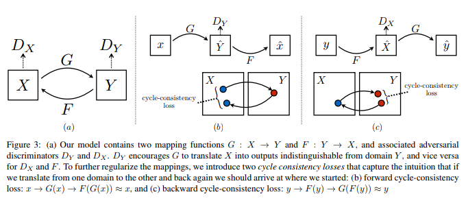
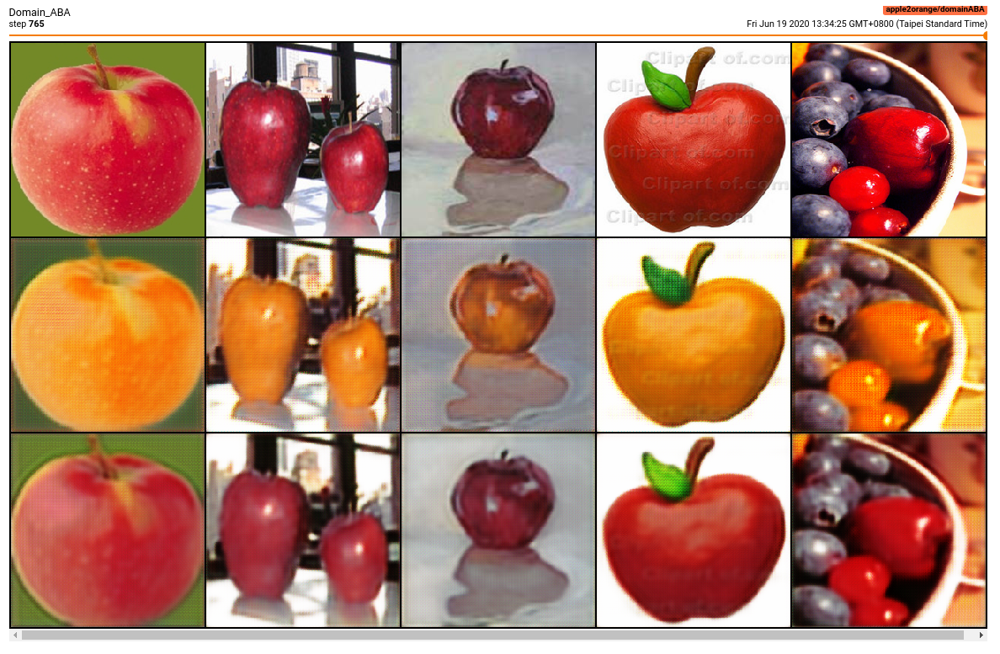
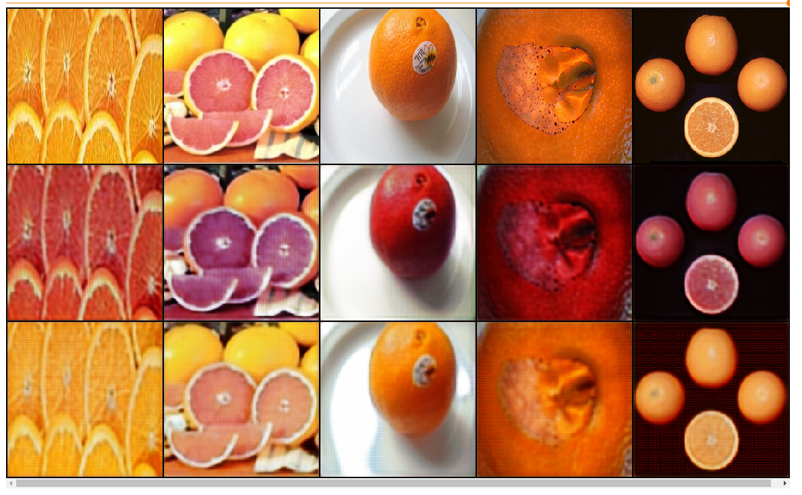

# trytry-cyclegan

Train a image-to-image translation model with unpaired dataset from two seperate domains.


## Unpaired image dataset
The most effective way to train an image-to-image translation model is to train the model with paired dataset. One is image from domain A, and the other one is image from domain B, which is the ground truth image for transformed image from domain A.

But paired dataset is expensive, it is hard to get the dataset. Therefore, the main contribution of CycleGAN is to successfully train an image-to-image translation model with unpaired dataset.

## Cycle consistency
To make the transformed image from domain A somehow reasonable to the raw image from domain A, during training CycleGAN add a cycle loss to regularize/constrain the transformed space so that the transformed image look similar to the raw image.


## Train Apple2Orange CycleGAN model
```bash
$ python main.py --config config/example.yml
```

## Check tensorboard
```bash
$ tensorboard --logdir="run" --host=0.0.0.0 --port=6006
```


